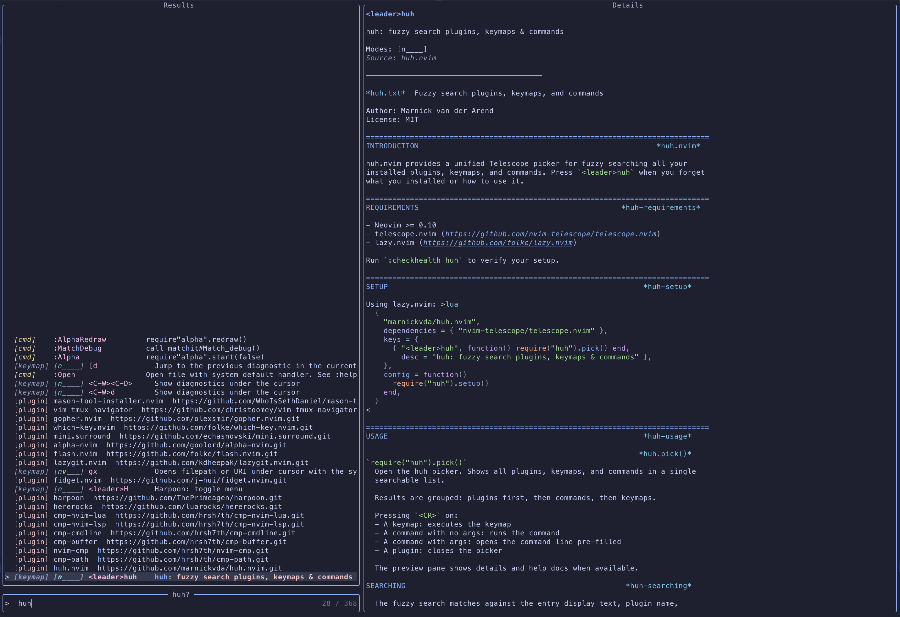

# huh.nvim

Fuzzy search your Neovim plugins, keymaps, and commands. Press `<leader>huh` when you forget what you installed or how
to use it.



## What it does

- **Zero config**: auto-discovers everything from lazy.nvim and the Neovim runtime, no registration step required
- **Inline help docs**: preview pane shows the plugin's vimdoc help alongside keymap/command details
- **Quick action**: Press `<CR>` on a keymap to execute it, on a command to run it, or browse and close with `<Esc>`

## Requirements

- [lazy.nvim](https://github.com/folke/lazy.nvim) — used for plugin discovery and declared key extraction
- [telescope.nvim](https://github.com/nvim-telescope/telescope.nvim) — picker UI

## Setup

```lua
{
  "marnickvda/huh.nvim",
  dependencies = { "nvim-telescope/telescope.nvim" },
  keys = {
    { "<leader>huh", function() require("huh").pick() end, desc = "huh: fuzzy search plugins, keymaps & commands" },
  },
  config = function()
    require("huh").setup()
  end,
}
```
